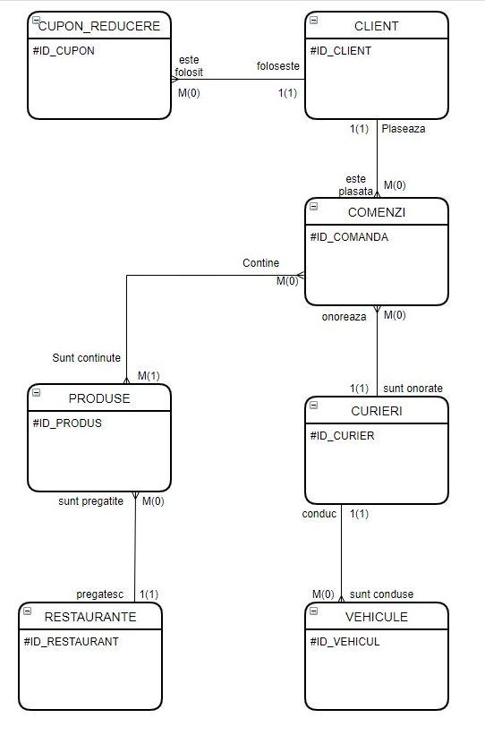

# PROECT - BAZE DE DATE

## Cuprins

1.Prezentarea bazei

1.1. Prezentarea modelului din lumea reală

1.2.Reguli generale

2.Diagrama entitate-relație

2.1.Ilustrare diagramă

2.2.Descrierea entităților, atributelor, cheilor, relațiilor și a cardinalităților

3.Diagrama conceptuală

3.1.Ilustrare diagramă

3.2.Descriere constrângeri de integritate

3.3.Schemele relaționale

4.Implementarea bazei de date

4.1.Crearea tabelelor

4.1.Inserarea datelor

---

### 1.Prezentarea bazei de date

#### 1.1.Prezentarea modelului din lumea reala

Principala activitate a firmei de curierat este de a asigura transportul
comenzii de la un restaurant la un client prin intermediul curierilor.
Firmele de curierat asigură transportul a milioane de comenzi în plan
local, anual.

Sistemele de gestiune a bazelor de date sunt construite pentru stocarea
și accesarea cantităților mari de informație. Firmele de curierat
gestionează de regulă datele milioanelor de comenzi, iar o bază de date
le permite să stocheze datele, să opereze pe ele și să le recupereze
atunci când este nevoie la cererea clienților.

Firma noastră de curierat este formată dintr-o echipă de curieri ce au
diferite vehicule și un lanț de restaurante care pot prepara diferite
produse. Totodată informațiile clienților, comenzilor și a
restaurantelor sunt reținute și sunt procesate cu ajutor unei baze de
date.

---

#### 1.2.Reguli generale

Baza de date are următoarele particularități:

-   Clientul trebuie să își introducă toate datele necesare pentru a
    plasa o comandă: nume, prenume, vârstă, număr de telefon și email,
    iar acesta poate avea opțional un cupon de reducere care se va
    aplica la orice comandă. De asemenea, acesta poate plasa mai multe
    comenzi simultan.

-   Pentru a plasa o comandă clientul trebuie să specifice adresa,
    opțional detalii oferite livratorului pentru a fi localizat mai
    ușor, produsul dorit și cantitatea acestuia.

-   Curierii au înregistrate ca date personale numele si prenumele,
    număr de telefon, data nașterii și obligatoriu unul și cel mult trei
    vehicule diferite că tip. Un curier poate sa duca o comanda, mai
    multe comenzi sau niciuna.

-   Vehiculele sunt înregistrate ca nume, tip și opțional număr de
    înmatriculare. Există trei tipuri de vehicule: mașină, scuter și
    bicicletă.

-   Există o listă de produse care pot fi comandate, iar acestea au
    trecute numele, prețul, timpul de preparare, greutatea, caloriile și
    alergenii dacă există.

-   Restaurantele trebuie să producă cel puțin un produs specific
    fiecăruia.

---

### 2.Diagrama entitate-relatie

#### 2.1.Ilustratie diagrama

---

#### 2.2.Descrierea entităților, atributelor, cheilor, relațiilor și a cardinalităților

Tabelul COMENZI este entitatea în jurul căreia este creată baza de date
și conține 7 câmpuri. Id-ul comenzii reprezintă cheia primară a
tabelului și este unică. ADRESA reprezintă câmpul în care clientul
introduce locația unde trebuie livrată comanda, DETALII\_LIVRATOR este
câmpul în care clientul poate adăuga detalii curierului, DATA este
câmpul care se creează atunci când clientul plasează comanda,
TIMP\_LIVRARE este un câmp calculat automat prin adăugarea la câmpul
DATA timpul de preparare al produselor plus un timp de livrare, iar
câmpurile ID\_CLIENT și ID\_CURIER fac legătură cu alte tabele, deci
sunt Foreign Keys. O comandă poate fi onorată de un singur curier, deci
relația între tabelele COMENZI și CURIERI este de M(0)-1(1), adică un
curier poate duce mai multe comenzi însă o comandă trebuie dusă de un
sigur curier.

Tabelul CURIERI conține 5 câmpuri. ID\_CURIER reprezintă id-ul unic al
unui curier și este cheia primară a tabelului. Entitățile nume, prenume,
telefon, vârstă reprezintă datele personale ale curierului.

Tabelul VEHICULE conține 5 câmpuri. ID\_VEHICUL reprezintă id-ul unic al
unui vehicul și este cheia primară a tabelului. Entitățile nume, tip
sunt date legate de vehicul, NUMAR\_INMATRICULARE este numărul de
înmatriculare în cazul în care vehiculul este de tip mașină sau scuter,
iar câmpul ID\_CURIER este un Foreign Key și reprezintă legătură cu
tabelul CURIERI prin care se ține evidența vehiculelor care pot fi
conduse de un curier. Între tabelul CURIERI și VEHICULE există o relație
de 1(1) - M(0), adică un curier poate conduce mai multe vehicule, însă
vehiculele pot fi conduse de un sigur curier și exista vehicule ce nu
sunt conduse.

Tabelul CLIENȚI conține 6 câmpuri. ID\_CLIENT reprezintă id-ul unic al
unui client și este cheia primară a tabelului. Entitățile nume, prenume,
vârstă, telefon, email sunt date personale ale clientului iar câmpul
ID\_CUPON este un Foreign Key opțional, ce reprezintă legătură cu
tabelul CUPON\_REDUCERE prin care se ține evidența clienților care au
unul sau mai multe cupoane de reducere. Între tabelul CLIENȚI și
CUPON\_REDUCERE există o relație de 1(1) - M(0), adică un client poate
folosit unul , mai multe cupoane de reducere sau nici unul, iar un cupon
de reducere are un client, oferit clienților fideli.

Tabelul CUPON\_REDUCERE conține 3 câmpuri. ID\_CUPON reprezintă id-ul
unic al unui cupon de reducere și este cheia primară a tabelului.
Entitățile data\_expirare și discount sunt informații legate de
cupoanele respective.

Tabelul PRODUSE\_COMANDA este un tabel de legătură conținând ID\_COMANDA
alături de ID\_PRODUS ce sunt Foreign Keys care fac legătură cu tabelele
COMENZI respectiv PRODUSE.

Tabelul PRODUSE conține 8 câmpuri. ID\_PRODUS reprezintă id-ul unic al
unui produs și cheia primară a tabelului. Entitățile nume, preț, timp
preparare, greutate, opțional alergeni sunt date legate de fiecare
produs. ID\_RESTAURANT este Foreign Key și face legătură cu tabelul
RESTAURANTE prin care se ține evidența produselor care pot fi preparate
de un restaurant. Între tabelul PRODUSE și RESTAURANTE există o relație
de M(0) - 1(1), adică un restaurant poate pregăti mai multe produse, iar
un produs poate fi pregătit de un singur restaurant.

Tabelul RESTAURANTE conține 3 câmpuri. ID\_RESTAURANT reprezintă id-ul
unic al unui restaurant și cheia primară a restaurantului. Entitățile
nume și adresă reprezintă datele fiecărui restaurant.

---

### 3.Diagramă conceptuală

#### 3.1.Ilustrare diagramă

---

#### 3.2.Descriere constrângeri de integritate

Tabelul VEHICULE:

-   NULLABLE:

<!-- -->

-   NUMAR\_INMATRICULARE-varchar(7)

<!-- -->

-   NOT NULL:

<!-- -->

-   NUME-varchar(100)

<!-- -->

-   PRIMARY KEY:

<!-- -->

-   ID\_VEHICULE-int

<!-- -->

-   FOREIGN KEY:

<!-- -->

-   ID\_CURIER-int

<!-- -->

-   CHECK:

<!-- -->

-   TIP-varchar(30) ( trebuie introduse doar masina, scuter sau
    bicicleta)

Tabelul CURIERI:

-   NOT NULL:

<!-- -->

-   NUME-varchar(50)

-   PRENUME -varchar(50)

-   DATA\_NASTERII-date

<!-- -->

-   PRIMARY KEY:

<!-- -->

-   ID\_CURIER-int

<!-- -->

-   CHECK:

<!-- -->

-   TELEFON-varchar(10) (numărul de telefon trebuie sa aibă 10 cifre)

Tabelul CUPON\_REDUCERE:

-   NOT NULL:

<!-- -->

-   DATA\_EXPIRARE-date

<!-- -->

-   PRIMARY KEY:

<!-- -->

-   ID\_CUPON-int

<!-- -->

-   CHECK:

<!-- -->

-   DISCOUND-int (discount-ul trebuie sa fie mai mare de 0)

Tabelul CLIENTI

-   NOT NULL:

<!-- -->

-   NUME-varchar(50)

-   PRENUME-varchar(50)

-   DATA\_NASTERII-DATE

-   EMAIL-varchar(50)

<!-- -->

-   PRIMARY KEY:

<!-- -->

-   ID\_CLIENT-int

<!-- -->

-   FOREIGN KEY:

<!-- -->

-   ID\_CUPON:-int

<!-- -->

-   CHECK:

<!-- -->

-   TELEFON-varchar(10) (numărul de telefon trebuie sa aibă 10 cifre)

Tabelul COMENZI:

-   NOT NULL:

<!-- -->

-   ADRESA -varchar(256)

-   TIMP\_LIVRARE -int

-   DATA -date

<!-- -->

-   NULLABE:

<!-- -->

-   DETALII\_LIVRATOR -varchar(256)

<!-- -->

-   PRIMARY KEY:

<!-- -->

-   ID\_COMANDA -int

<!-- -->

-   FOREIGN KEY:

<!-- -->

-   ID\_CURIER -int

-   ID\_CLIENT --int

<!-- -->

-   CHECK:

<!-- -->

-   CANTITATE --int(cantitatea trebuie sa fie mai mare de 0)

Tabelul PRODUSE\_COMANDA:

-   FOREIGN KEY:

<!-- -->

-   ID\_COMANDA -int

-   ID\_PRODUS --int

Tabelul PRODUSE:

-   NOT NULL:

<!-- -->

-   NUME -varchar(100)

<!-- -->

-   PRIMARY KEY:

<!-- -->

-   ID\_PRODUS-int

<!-- -->

-   FOREIGN KEY:

<!-- -->

-   ID\_RESTAURANT-int

<!-- -->

-   CHECK:

<!-- -->

-   PRET-float(prețul trebuie sa fie mai mare de 0)

-   TIMP\_PREPARARE-int(timpul de preparare trebuie sa fie mai mare
    de 0)

-   GREUTATE-float(greutatea trebuie sa fie mai mare de 0)

-   CALORII-float(caloriile trebuie sa fie mai mare de 0)

Tabelul RESTAURANTE:

-   NOT NULL:

<!-- -->

-   NUME -varchar(100)

-   ADRESA -varchar(256)

<!-- -->

-   PRIMARY KEY:

<!-- -->

-   ID\_RESTAURANT --int

---

#### 3.3.Schemele relaționale

-   Tabelul CLIENTI are cheia străină ID\_CUPON care face legătura cu
    tabelul CUPON\_REDUCERE. Dacă înregistrările din tabelul
    CUPON\_REDUCERE se vor șterge, înregistrările din tabelul CLIENT ce
    aveau id-ul respectiv va deveni NULL pentru că acest Foreign Key
    este opțional și nu mai este îndeplinită condiția ca orice cupon de
    reducere să aibă un client.

-   Tabelul VEHICULE are cheia străină ID\_CURIER care face legătură cu
    tabelul CURIERI. Dacă înregistrările din tabelul CURIERI sunt
    șterse, atunci vehiculele ce aveau id-urile respective vor deveni
    NULL.

-   Tabelul PRODUSE\_COMANDA este construit cu scopul de a îndeplini
    relația de many to many între tabelul PRODUSE și COMENZI cu ajutorul
    Foreign Keys ID\_COMANDA și ID\_PRODUS. Dacă una dintre înregistrări
    se șterg și înregistrarea din PRODUSE\_COMANDA va fi ștearsă.

-   Tabelul COMENZI conține diverse Foreign Keys precum ID\_CURIER care
    face legătura cu tabelul CURIERI și ID\_CLIENT care face legătura cu
    tabelul CLIENTI. Dacă o înregistrare din tabelele conectate se va
    șterge, implicit se va șterge și comanda respectivă deoarece nu
    poate exista o comandă fără curier, și de asemenea, fără client.

-   Tabelul PRODUSE conține Forgein key-ul ID\_RESTAURANT care face
    legătură cu tabelul RESTAURANTE. Dacă o înregistrare a unui
    restaurante este ștearsă, atunci produsele ce erau preparate de
    restaurantul respectiv vor fi șterse, orice produs trebuie preparat
    de un restaurant.

---

### 4.Implementarea bazei de date

#### 4.1.Crearea tabelelor

 CREATE TABLE CURIERI

 (

 ID\_CURIER INT NOT NULL,

 NUME VARCHAR(50) NOT NULL,

 PRENUME VARCHAR(50) NOT NULL,

 TELEFON VARCHAR(10) NOT NULL,

 CONSTRAINT CHECK\_TELEFON\_CURIERI CHECK(TELEFON NOT LIKE
 \'%\[\^0-9\]%\' AND LENGTH(TELEFON)=10),

 DATA\_NASTERII DATE NOT NULL,

 PRIMARY KEY (ID\_CURIER)

 );

 CREATE TABLE RESTAURANTE

 (

 ID\_RESTAURANT INT NOT NULL,

 ADRESA VARCHAR(256) NOT NULL,

 NUME VARCHAR(100) NOT NULL,

 PRIMARY KEY (ID\_RESTAURANT)

 );

 CREATE TABLE VEHICULE

 (

 ID\_VEHICUL INT NOT NULL,

 NUME VARCHAR(100) NOT NULL,

 TIP VARCHAR(30) NOT NULL,

 CONSTRAINT CHECK\_TIP CHECK(TIP IN (\'masina\', \'scuter\',
 \'bicicleta\')),

 NUMAR\_IMATRICULARE VARCHAR(7),

 ID\_CURIER INT,

 PRIMARY KEY (ID\_VEHICUL),

 FOREIGN KEY (ID\_CURIER) REFERENCES CURIERI(ID\_CURIER) ON DELETE SET
 NULL

 );

 CREATE TABLE CUPON\_REDUCERE

 (

 ID\_CUPON INT NOT NULL,

 DATA\_EXPIRARE DATE NOT NULL,

 DISCOUNT INT NOT NULL,

 CONSTRAINT CHECK\_DISCOUNT CHECK(DISCOUNT\0),

 PRIMARY KEY (ID\_CUPON)

 );

 CREATE TABLE CLIENTI

 (

 ID\_CLIENT INT NOT NULL,

 NUME VARCHAR(50) NOT NULL,

 PRENUME VARCHAR(50) NOT NULL,

 DATA\_NASTERII DATE NOT NULL,

 TELEFON VARCHAR(10) NOT NULL,

 CONSTRAINT CHECK\_TELEFON\_CLIENTI CHECK(TELEFON NOT LIKE
 \'%\[\^0-9\]%\' AND LENGTH(TELEFON)=10),

 EMAIL VARCHAR(100) NOT NULL,

 ID\_CUPON INT,

 PRIMARY KEY (ID\_CLIENT),

 FOREIGN KEY (ID\_CUPON) REFERENCES CUPON\_REDUCERE(ID\_CUPON) ON
 DELETE SET NULL

 );

 CREATE TABLE COMENZI

 (

 ID\_COMANDA INT NOT NULL,

 ADRESA VARCHAR(256) NOT NULL,

 DETALII\_LIVRATOR VARCHAR(256),

 TIMP\_LIVRARE INT NOT NULL,

 DATA DATE NOT NULL,

 CANTITATE INT NOT NULL,

 CONSTRAINT CHECK\_CANTITATE CHECK(CANTITATE\0),

 ID\_CLIENT INT NOT NULL,

 ID\_CURIER INT NOT NULL,

 PRIMARY KEY (ID\_COMANDA),

 FOREIGN KEY (ID\_CLIENT) REFERENCES CLIENTI(ID\_CLIENT) ON DELETE
 CASCADE,

 FOREIGN KEY (ID\_CURIER) REFERENCES CURIERI(ID\_CURIER) ON DELETE
 CASCADE

 );

 CREATE TABLE PRODUSE

 (

 ID\_PRODUS INT NOT NULL,

 PRET FLOAT NOT NULL,

 CONSTRAINT CHECK\_PRET CHECK(PRET\0),

 GREUTATE FLOAT NOT NULL,

 CONSTRAINT CHECK\_GREUTATE CHECK(GREUTATE\0),

 CALORII FLOAT NOT NULL,

 CONSTRAINT CHECK\_CALORII CHECK(CALORII\0),

 NUME VARCHAR(100) NOT NULL,

 ALERGENI VARCHAR(256),

 TIMP\_PREPARARE INT NOT NULL,

 CONSTRAINT CHECK\_TIMP\_PREPARARE CHECK(TIMP\_PREPARARE\0),

 ID\_RESTAURANT INT NOT NULL,

 PRIMARY KEY (ID\_PRODUS),

 FOREIGN KEY (ID\_RESTAURANT) REFERENCES RESTAURANTE(ID\_RESTAURANT) ON
 DELETE CASCADE

 );

 CREATE TABLE PRODUSE\_COMANDA

 (

 ID\_COMANDA INT NOT NULL,

 ID\_PRODUS INT NOT NULL,

 PRIMARY KEY (ID\_COMANDA, ID\_PRODUS),

 FOREIGN KEY (ID\_COMANDA) REFERENCES COMENZI(ID\_COMANDA) ON DELETE
 CASCADE,

 FOREIGN KEY (ID\_PRODUS) REFERENCES PRODUSE(ID\_PRODUS) ON DELETE
 CASCADE

 );
 
 ---

 #### 4.2.Inserarea datelor

 INSERT INTO RESTAURANTE VALUES(1,\'Aurora Mall\',\'KFC\');

 INSERT INTO RESTAURANTE VALUES(2,\'Aurora Mall\',\'McDonalds\');

 INSERT INTO RESTAURANTE VALUES(3,\'Strada Basca Nr. 1\',\'Oppio\');

 INSERT INTO RESTAURANTE VALUES(4,\'Strada Colonel Ion Buzoianu
 Nr.14\',\'Curtea Veche\');

 INSERT INTO RESTAURANTE VALUES(5,\'Bd. Unirii Sud\',\'New Pizza\');

 INSERT INTO RESTAURANTE VALUES(6,\'Bulevardul Gării\',\'Bistro
 Junior\');

 INSERT INTO RESTAURANTE VALUES(7,\'Strada Victoriei nr.
 7\',\'Pik-Nik\');

 INSERT INTO RESTAURANTE VALUES(8,\'Aleea Sporturilor
 21\',\'Cristal\');

 INSERT INTO RESTAURANTE VALUES(9,\'Strada Mesteacănului nr.
 10\',\'Orhideea\');

 INSERT INTO RESTAURANTE VALUES(10,\'Strada Mesteacănului nr.
 22\',\'O\'\'Brothers Social Pub\');

 INSERT INTO PRODUSE VALUES(1,17,0.3,300,\'CLUBHOUSE VITA\',NULL,5,2);

 INSERT INTO PRODUSE VALUES(2,23,0.25,333,\'CRAZY HAMBURGER\',\'Oua,
 faina\',6,2);

 INSERT INTO PRODUSE VALUES(3,56.5,2.8,1302,\'CHRISTMAS BUCKET\',\'Oua,
 usturoi, mustar, lapte, faina\',10,1);

 INSERT INTO PRODUSE VALUES(4,16,0.35,496,\'SMART BOX\',\'Oua, usturoi,
 mustar, lapte, faina\',7,1);

 INSERT INTO PRODUSE VALUES(5,32,0.4,398,\'Frigarui de
 pui\',NULL,20,3);

 INSERT INTO PRODUSE VALUES(6,26,0.36,100,\'Shrimp Maki\',NULL,25,3);

 INSERT INTO PRODUSE VALUES(7,10,0.25,70,\'Ciorba de
 legume\',NULL,10,4);

 INSERT INTO PRODUSE VALUES(8,25,0.33,280,\'Pizza Hawaii\',NULL,22,4);

 INSERT INTO PRODUSE VALUES(9,18,0.33,300,\'Pizza
 Margherita\',\'mozzarella,oregano\',19,5);

 INSERT INTO PRODUSE VALUES(10,22,0.33,310,\'Pizza
 Diavolo\',\'mozzarella,tabasco\',17,5);

 INSERT INTO PRODUSE VALUES(11,59,0.7,870,\'Bistro cina-2
 persoane\',NULL,24,6);

 INSERT INTO PRODUSE VALUES(12,110,1.5,1800,\'Bistro cina-4
 persoane\',NULL,36,6);

 INSERT INTO PRODUSE VALUES(13,19,0.5,400,\'Paste cu piept de
 pui\',\'usturoi\',20,7);

 INSERT INTO PRODUSE VALUES(14,27,0.5,350,\'Paste
 carbonara\',\'parmezan\',20,7);

 INSERT INTO PRODUSE VALUES(15,16,0.3,400,\'Meniu mici cu
 mujdei\',\'usturoi\',10,8);

 INSERT INTO PRODUSE VALUES(16,59,1,1400,\'Platou
 pastrama\',\'lapte\',30,8);

 INSERT INTO PRODUSE VALUES(17,40,0.3,450,\'Muschiulet de
 porc\',\'mustar,lapte\',35,9);

 INSERT INTO PRODUSE VALUES(18,50,0.25,350,\'Tentacule de
 calamar\',\'lapte, usturoi\',30,9);

 INSERT INTO PRODUSE VALUES(19,39,0.4,460,\'Carne de
 garnita\',NULL,25,10);

 INSERT INTO PRODUSE VALUES(20,45,0.6,500,\'Coaste de
 porc\',NULL,20,10);

 INSERT INTO CUPON\_REDUCERE
 VALUES(1,TO\_DATE(\'22-12-2021\',\'DD-MM-YYYY\'),10);

 INSERT INTO CUPON\_REDUCERE
 VALUES(2,TO\_DATE(\'10-11-2021\',\'DD-MM-YYYY\'),10);

 INSERT INTO CUPON\_REDUCERE
 VALUES(3,TO\_DATE(\'15-5-2021\',\'DD-MM-YYYY\'),15);

 INSERT INTO CUPON\_REDUCERE
 VALUES(4,TO\_DATE(\'13-6-2021\',\'DD-MM-YYYY\'),15);

 INSERT INTO CUPON\_REDUCERE
 VALUES(5,TO\_DATE(\'30-12-2021\',\'DD-MM-YYYY\'),20);

 INSERT INTO CLIENTI
 VALUES(1,\'Ionel\',\'Cirmaciu\',TO\_DATE(\'03-04-1999\',\'DD-MM-YYYY\'),\'0735998673\',\'ionelcirmaciu\@gmail.com\',1);

 INSERT INTO CLIENTI
 VALUES(2,\'Cocor\',\'Sebastian\',TO\_DATE(\'04-06-1990\',\'DD-MM-YYYY\'),\'0735795045\',\'cocorsebatian\@gmail.com\',2);

 INSERT INTO CLIENTI
 VALUES(3,\'Diaconu\',\'Ion\',TO\_DATE(\'05-12-1988\',\'DD-MM-YYYY\'),\'0786709129\',\'diaconuion\@gmail.com\',3);

 INSERT INTO CLIENTI
 VALUES(4,\'Ene\',\'Andrei\',TO\_DATE(\'03-04-2000\',\'DD-MM-YYYY\'),\'0735998532\',\'eneandrei\@gmail.com\',4);

 INSERT INTO CLIENTI
 VALUES(5,\'Horhocica\',\'Laurentiu\',TO\_DATE(\'06-10-1996\',\'DD-MM-YYYY\'),\'0742675333\',\'horhocicalaurentiu\@gmail.com\',5);

 INSERT INTO CLIENTI
 VALUES(6,\'Marin\',\'Ovidiu\',TO\_DATE(\'22-6-1997\',\'DD-MM-YYYY\'),\'0743556987\',\'marinovidiu\@gmail.com\',NULL);

 INSERT INTO CLIENTI
 VALUES(7,\'Mircescu\',\'Razvan\',TO\_DATE(\'05-11-1970\',\'DD-MM-YYYY\'),\'0753776123\',\'miercescurazvan\@gmail.com\',NULL);

 INSERT INTO CLIENTI
 VALUES(8,\'Olaru\',\'Eduard\',TO\_DATE(\'29-06-1993\',\'DD-MM-YYYY\'),\'0740890768\',\'olarueduard\@gmail.com\',NULL);

 INSERT INTO CLIENTI
 VALUES(9,\'Papuc\',\'Georgian\',TO\_DATE(\'19-09-1999\',\'DD-MM-YYYY\'),\'0735789345\',\'papucgeorgian\@gmail.com\',NULL);

 INSERT INTO CLIENTI
 VALUES(10,\'State\',\'Iulian\',TO\_DATE(\'04-05-1970\',\'DD-MM-YYYY\'),\'0735456851\',\'stateiulian\@gmail.com\',NULL);

 INSERT INTO CURIERI
 VALUES(1,\'Troy\',\'Alexandru\',\'0735667988\',TO\_DATE(\'08-09-1999\',\'DD-MM-YYYY\'));

 INSERT INTO CURIERI
 VALUES(2,\'Petre\',\'Vlad\',\'0736887654\',TO\_DATE(\'09-11-1985\',\'DD-MM-YYYY\'));

 INSERT INTO CURIERI
 VALUES(3,\'Anton\',\'Remus\',\'0740678543\',TO\_DATE(\'03-06-2000\',\'DD-MM-YYYY\'));

 INSERT INTO CURIERI
 VALUES(4,\'Vlad\',\'Andrei\',\'0745990887\',TO\_DATE(\'27-04-1967\',\'DD-MM-YYYY\'));

 INSERT INTO CURIERI
 VALUES(5,\'Duta\',\'Achime\',\'0755654324\',TO\_DATE(\'01-05-1976\',\'DD-MM-YYYY\'));

 INSERT INTO CURIERI
 VALUES(6,\'Bogdan\',\'Vali\',\'0746776432\',TO\_DATE(\'02-03-1988\',\'DD-MM-YYYY\'));

 INSERT INTO CURIERI
 VALUES(7,\'Branza\',\'Bogdan\',\'0756889990\',TO\_DATE(\'21-02-1995\',\'DD-MM-YYYY\'));

 INSERT INTO CURIERI
 VALUES(8,\'Albina\',\'Robert\',\'0734778098\',TO\_DATE(\'21-11-1989\',\'DD-MM-YYYY\'));

 INSERT INTO CURIERI
 VALUES(9,\'Bucurie\',\'Andrei\',\'0736887654\',TO\_DATE(\'22-07-1977\',\'DD-MM-YYYY\'));

 INSERT INTO CURIERI
 VALUES(10,\'Besleaga\',\'Bogdan\',\'0744321678\',TO\_DATE(\'11-11-1979\',\'DD-MM-YYYY\'));

 INSERT INTO VEHICULE VALUES(1,\'Renault\',\'masina\',\'BZ10PMM\',1);

 INSERT INTO VEHICULE VALUES(2,\'Dacia
 Logan\',\'masina\',\'BZ11ASD\',2);

 INSERT INTO VEHICULE VALUES(3,\'CROSS\',\'scuter\',\'BZ13CPN\',2);

 INSERT INTO VEHICULE VALUES(4,\'LIV\',\'bicicleta\',NULL,2);

 INSERT INTO VEHICULE VALUES(5,\'Dacia
 Duster\',\'masina\',\'BZ19AKC\',3);

 INSERT INTO VEHICULE VALUES(6,\'Renault\',\'scuter\',\'BZ20AKC\',3);

 INSERT INTO VEHICULE VALUES(7,\'Matiz\',\'masina\',\'BZ20TRW\',4);

 INSERT INTO VEHICULE VALUES(8,\'LIV\',\'bicicleta\',NULL,4);

 INSERT INTO VEHICULE VALUES(9,\'Honda\',\'scuter\',\'BZ99OPR\',5);

 INSERT INTO VEHICULE VALUES(10,\'SYM\',\'scuter\',\'BZ66AIR\',6);

 INSERT INTO VEHICULE VALUES(11,\'Yamaha\',\'scuter\',\'BZ77AXP\',7);

 INSERT INTO VEHICULE VALUES(12,\'ford\',\'masina\',\'BZ69DXP\',8);

 INSERT INTO VEHICULE VALUES(13,\'Mountainbike\',\'bicicleta\',NULL,9);

 INSERT INTO VEHICULE
 VALUES(14,\'Chevrolet\',\'masina\',\'BZ22AUD\',10);

 INSERT INTO COMENZI VALUES(1,\'Bloc 15N, scara b, ap 15\',\'intrarea
 este prin spate\',15,sysdate,2,1,1);

 INSERT INTO COMENZI VALUES(2,\'Block 2A ap 4\',NULL,20,sysdate,3,2,1);

 INSERT INTO COMENZI VALUES(3,\'Block 112 ap 10\',\'blocul este lana
 MegaImage\',10,sysdate,1,3,2);

 INSERT INTO COMENZI VALUES(4,\'Str. Ion Luca Caragiale Nr.22\',\'Prima
 casa dupa magazinul de constructii\',25,sysdate,1,4,3);

 INSERT INTO COMENZI VALUES(5,\'Bloc 52N\',\'intrare prin
 fata\',15,sysdate,2,5,4);

 INSERT INTO COMENZI VALUES(6,\'Str. Ion Luca Caragiale Nr.22\',\'Prima
 casa dupa magazinul de constructii\',25,sysdate,2,4,3);

 INSERT INTO COMENZI VALUES(7,\'Bloc 33H, ap
 32\',NULL,20,sysdate,4,6,5);

 INSERT INTO COMENZI VALUES(8,\'Bloc 10B, ap 2\',\'lasati comanda la
 usa\',10,sysdate,2,7,6);

 INSERT INTO COMENZI VALUES(9,\'Bloc 32B, ap 34\',\'sunati la interfon
 cand ajungeti\',5,sysdate,1,7,6);

 INSERT INTO COMENZI VALUES(10,\'Bloc 11C, ap
 2\',NULL,10,sysdate,2,8,7);

 INSERT INTO COMENZI VALUES(11,\'Bloc 32C, ap 1\',\'La etajul
 1\',22,sysdate,1,9,7);

 INSERT INTO COMENZI VALUES(12,\'Bloc 155, ap
 18\',NULL,30,sysdate,3,10,8);

 INSERT INTO PRODUSE\_COMANDA VALUES(1,18);

 INSERT INTO PRODUSE\_COMANDA VALUES(2,2);

 INSERT INTO PRODUSE\_COMANDA VALUES(3,20);

 INSERT INTO PRODUSE\_COMANDA VALUES(4,10);

 INSERT INTO PRODUSE\_COMANDA VALUES(5,13);

 INSERT INTO PRODUSE\_COMANDA VALUES(6,18);

 INSERT INTO PRODUSE\_COMANDA VALUES(7,5);

 INSERT INTO PRODUSE\_COMANDA VALUES(8,7);

 INSERT INTO PRODUSE\_COMANDA VALUES(9,9);

 INSERT INTO PRODUSE\_COMANDA VALUES(10,13);

 INSERT INTO PRODUSE\_COMANDA VALUES(11,2);

 INSERT INTO PRODUSE\_COMANDA VALUES(12,3);

 COMMIT;